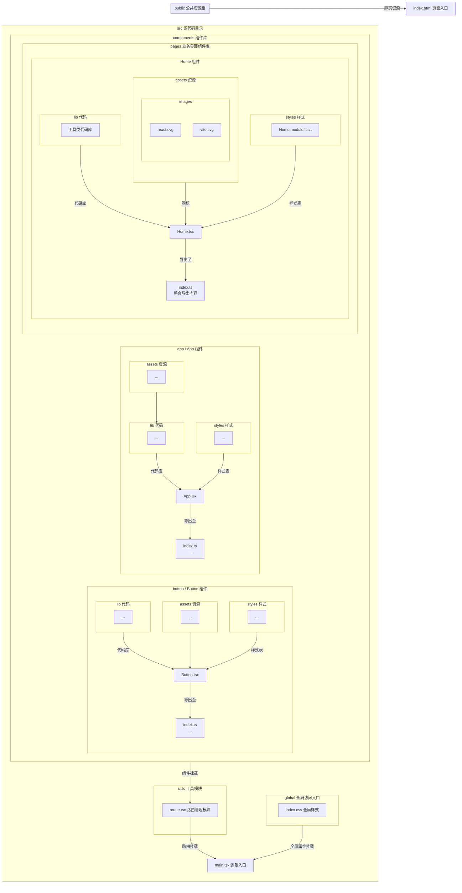

# Vite + React + TypeScript 创建模板

个人自用

## 安装使用

```shell
npm create nbc-app < projectName | 可选 >
# yarn create nbc-app < projectName | 可选 >
# pnpm create nbc-app < projectName | 可选 >
```

> 当然也可以直接克隆项目  
> 感兴趣的还可以查看个人 [汉化版 React DevTools](https://github.com/NiButCrazy/react-devtools-extension-chinese)


> [!NOTE]
> **小提示**
> 如果你使用的是 `webstorm`，断点调试功能需要在IDE运行配置中勾选`打开浏览器`和`使用JavaScript调试器`，
> 当然也可以额外配置一个 Javascript 的运行配置专门启动`断点调试`，这样**断点服务器**和**vite服务器**各管各的**互不影响**。
>
> 另外，如果你发现断点调试时 Chrome 是一个全新的页面，没有你的个人数据、扩展以及配置，可以为chrome的用户数据创建一个**软连接
**
> `mklink /D <link> <target>`，然后把链接设置到 `webstorm` 的浏览器配置里就可以了
>
具体原因和解决方法请查看[官方文档](https://www.jetbrains.com/zh-cn/help/webstorm/2025.1/configuring-javascript-debugger.html)

> [!TIP]
> vite 服务运行时，可直接在运行窗口中 `Ctrl + Shift + 鼠标左键` 点击服务器链接，
> 这样是直接打开`断点调试的功能`，十分方便

### 第三方库

- React Router - 路由管理
- Zustand - 全局状态管理
- Less - 样式预处理

[流程图](./.idea/__comment__/Project.mermaid)


