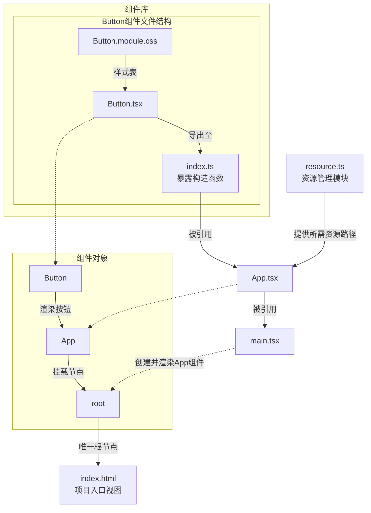

# Vite + React + TypeScript + Tailwind 创建模板

[流程图](./public/__comment__/Project.mermaid)

```mermaid
flowchart TB

    subgraph 组件对象
        Button[Button] --渲染按钮--> App[App] --挂载节点--> root[root]
    end

    subgraph 组件库
        subgraph Button组件文件结构
            Button.module.css --样式表-->Button.tsx[Button.tsx] --导出至--> index.ts[index.ts<br>暴露构造函数]
        end

        Button.tsx -.-> Button
    end
    App.tsx[App.tsx]
    main.tsx[main.tsx]
    index.ts --被引用--> App.tsx
    App.tsx -.-> App
    App.tsx --被引用--> main.tsx
    main.tsx -.创建并渲染App组件.-> root
    resource.ts[resource.ts<br>资源管理模块] --提供所需资源路径--> App.tsx
    root --唯一根节点--> index.html[index.html<br>项目入口视图]
```