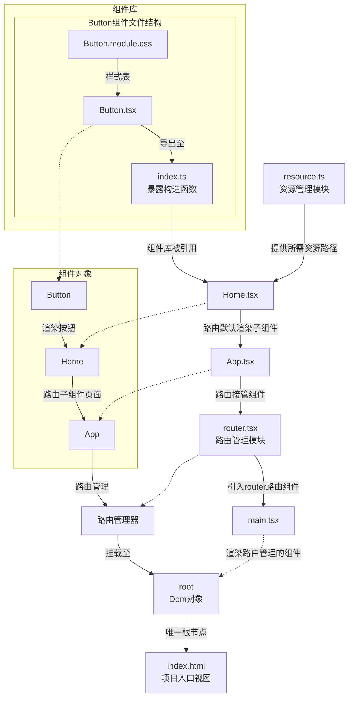

# Vite + React + TypeScript 创建模板

### 第三方库
- Tailwind CSS - 基础样式表
- React Router - 路由管理
- Zustand - 状态管理

[流程图](./public/__comment__/Project.mermaid)

```mermaid
flowchart TB

    subgraph 组件对象
        Button[Button] --渲染按钮--> Home[Home] --路由子组件页面--> App[App]
    end
    Home.tsx -.-> Home
    App[App] --路由管理--> router-obj[路由管理器] --挂载至--> root[root<br>Dom对象]
    subgraph 组件库
        subgraph Button组件文件结构
            Button.module.css --样式表-->Button.tsx[Button.tsx] --导出至--> index.ts[index.ts<br>暴露构造函数]
        end

        Button.tsx -.-> Button
    end
    Home.tsx[Home.tsx]
    App.tsx[App.tsx]
    main.tsx[main.tsx]
    router[router.tsx<br>路由管理模块]
%%    组件库 --组件被路由集中管理--> router
    router--引入router路由组件--> main.tsx


    Home.tsx --路由默认渲染子组件--> App.tsx
    index.ts --组件库被引用--> Home.tsx
    App.tsx -.-> App
    router -.-> router-obj
    App.tsx --路由接管组件--> router

    main.tsx -.渲染路由管理的组件.-> root
    resource.ts[resource.ts<br>资源管理模块] --提供所需资源路径--> Home.tsx
    root --唯一根节点--> index.html[index.html<br>项目入口视图]
```